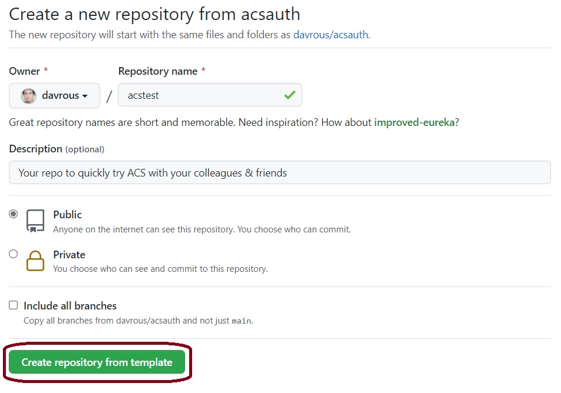

# Azure Communication Services Quick Starter

[Azure Communication Services (ACS)](https://azure.microsoft.com/en-us/services/communication-services) is a set of rich communication APIs, video APIs, and SMS APIs for deploying your applications across any device, on any platform. If you’re looking on enabling **chat**, **audio/video** conferencing, **phone calls** or **SMS** inside an existing app, you should have a look to this service. Please read [our ACS documentation](https://docs.microsoft.com/en-us/azure/communication-services/) to know more. 

This repo is used as a starter for a _very basic_ HTML web application using no front-end frameworks. It shows how to map an identity provided by a [Static Web App](https://docs.microsoft.com/en-us/azure/static-web-apps/overview) (Github, Microsoft, Twitter or Google) to an ACS identity. You can then **deploy this sample is a couple of minutes** following the instructions below and share the URL to the web app to **do calls to another user using ACS** or to **join a Microsoft Teams meeting** like described in this video: 

This repo also contains a more advanced **Metaverse demo** allowing to **call someone in Teams from a VR environment** running in the browser like demonstrated in this short video: 

## How to deploy the sample in minutes

### Step 1 - copy this repo in your Github repositories

First, you need to be logged in on Github and then press on the green "**use this template**" button:

Then fill the required properties, be sure to make it public and press "**Create repository from template**" button:

### Step 2 - provision all required resources using the 'Deploy To Azure' button

This will copy this repo into your Github account. Simply click on the "**Deploy To Azure**" button below:

In the various regions you'll choose, this will create a dedicated ressource group (named rg-*yourname*) and will automatically deploy inside it:

- an [Azure Communication Services](https://docs.microsoft.com/en-us/azure/communication-services/) ressource 
- a [Cosmos DB](https://docs.microsoft.com/en-us/azure/cosmos-db/)
- a [Static Web App](https://docs.microsoft.com/en-us/azure/static-web-apps/) containing an [Azure Function](https://docs.microsoft.com/en-us/azure/azure-functions/) that will be already configured to point to the Cosmos DB & ACS connection strings 

### Step 3 - Grab the Static Web App deployment token from the Azure Portal

Once completed, you'll have a similar screen indicating your deployment is complete:

We're almost done! We now need to associate your Github repo with the freshly provisionned Azure Static Web App. For that, open the new resource group just created by clicking on it. It should be named "rg-*yourname*" like in the above screenshot. You'll then see the 3 resources created inside this resource group:

Click on the Static Web App named "sttapp-*yourname*" then click on the "**Manage deployment token**" button and copy to the clipboard the secret token.

### Step 4 - Copy the SWA deployment token as a secret in your Github repo

Now to be able to run your GitHub Actions workflow to deploy the ACS sample demonstrated in the videos, you need to store the SWA deployment token in a secret value named `AZURE_STATIC_WEB_APPS_API_TOKEN`. For that, go into the **Settings** of your Github repo and then navigate to the **Secrets->Actions** section to create a **New repository secret** key.

### Step 5 - Run the Github Actions deployment workflow

You finally need to run the workflow configured in this repo to deploy the code of the SWA to your Azure subscription. There are various ways to do that as the workflow is listening for either **push to the main branch** or **Pull Request**.

The easier way: simply **do a fake commit to the readme.md file** and this will trigger the deployment:

Once the workflow succeeded, navigate to the SWA URL that can be found in your Azure Portal:

And you should now be able to run the same demo as shown in this [YouTube video](https://youtu.be/Jbf50SL1ceI).

To know more about those samples, please read this blog article: [AVAILABLE SOON]

## Concepts used in this sample

## Metaverse demo

## Going Further

## Credits

I'd like to thank [Justin Yoo](https://twitter.com/justinchronicle) for his precious help on building the deployment scripts & logic of this repo. If you're interested in building similar deployments from your repo, Justin has written an awesome technical article about the job he's done: [Azure Apps Autopilot](https://dev.to/azure/azure-apps-autopilot-2ag8). 
