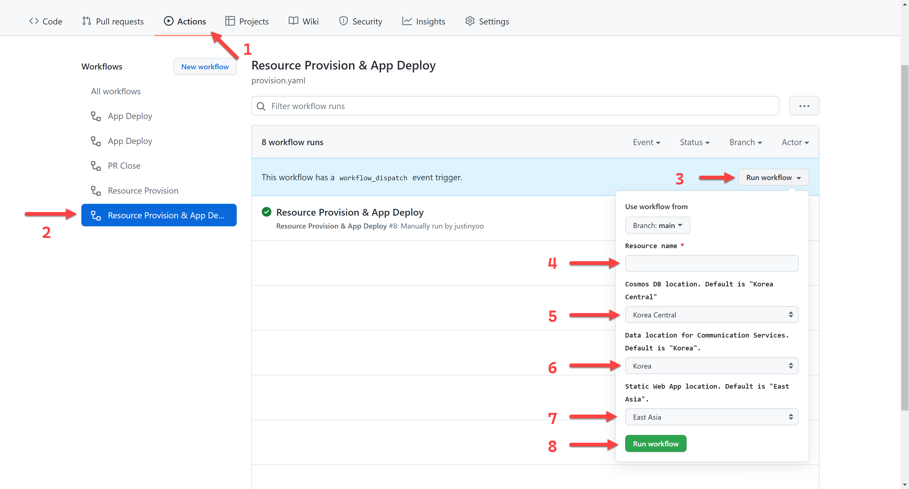

# Azure Communication Services Quick Starter

[Azure Communication Services (ACS)](https://azure.microsoft.com/en-us/services/communication-services) is a set of rich communication APIs, video APIs, and SMS APIs for deploying your applications across any device, on any platform. If you’re looking on enabling chat, audio/video conferencing, phone calls or SMS inside an existing app, you should have a look to this service. 

This repo is used as a starter for a _very basic_ HTML web application using no front-end frameworks. It shows how to map an identity provided by a [Static Web App](https://docs.microsoft.com/en-us/azure/static-web-apps/overview) (Github, Microsoft, Twitter or Google) to an ACS identity. You can then deploy this sample is a couple of minutes following the instructions below and share the URL to the web app to do calls to another user using ACS or to join a Microsoft Teams meeting like described in this video: 

TODO

This repo also contains a more advanced Metaverse demo allowing to call someone in Teams from a VR environment running in the browser like demonstrated in this short video: 

[](https://youtu.be/Wd4qNeLV_P8)

## How to deploy the sample in minutes

### via Azure Portal

Simply click on:

[](https://portal.azure.com/#create/Microsoft.Template/uri/https%3A%2F%2Fraw.githubusercontent.com%2Fdavrous%2Facsauth%2Fmain%2Finfra%2Fazuredeploy.json)

In the various regions you'll choose, this will create a dedicated ressource group (named rg-yourname) and will automatically deploy inside it:

- an Azure Communication Services ressource
- a CosmosDB 
- a Static Web App

### via PowerShell

```powershell
$resourceName = "<resource_name>"
$location = "<cosmosdb_resource_location>"
$dataLocation = "<acs_data_location>"
$appLocation = "<static_app_location>"

./infra/Provision-Resources.ps1 `
    -ResourceName $resourceName `
    -Location $location `
    -CosmosDbPrimaryRegion $location `
    -CommunicationServiceDataLocation $dataLocation `
    -StaticWebAppLocation $appLocation
```


### via Azure CLI

```bash
resourceName=<resource_name>
location=<cosmosdb_resource_location>
dataLocation=<acs_data_location>
appLocation=<static_app_location>

az deployment sub create \
    -l $location \
    -n Subscription \
    -f ./infra/azuredeploy.bicep \
    -p name=$resourceName \
    -p location=$location \
    -p cosdbaPrimaryRegion=$location \
    -p acsvcDataLocation=$dataLocation \
    -p sttappLocation=$appLocation \
    --verbose
```


### via GitHub Actions Workflow

To run this GitHub Actions workflow for resource provisioning and app deployment, you need to store those two secret values:

* `AZURE_CREDENTIALS`: The GitHub Actions workflow uses Azure CLI, which requires login to Azure. This value is used for it.
* `PA_TOKEN`: For Azure Static Web App deployment, the deployment key needs to be stored to GitHub Secrets. This value is used for it.

Once those two secrets are stored to your GitHub repository, then run the following steps.



1. Go to the ["Actions"](https://github.com/davrous/acsauth/actions) tab.
2. Click the ["Resource Provision & App Deploy](https://github.com/davrous/acsauth/actions/workflows/provision.yaml) tab.
3. Click the "Run workflow" button.
4. Enter the resource name into the "Resource name" field.
5. Select the Cosmos DB location. Default is "Korea Central".
6. Select the Azure Communication Services data location. Default is "Korea".
7. Select the Static Web App location. Default is "East Asia".
8. Click the "Run workflow" button.

Once completed, you will see the Azure Static Web App is up and running.

